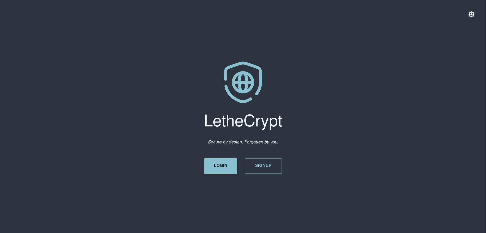
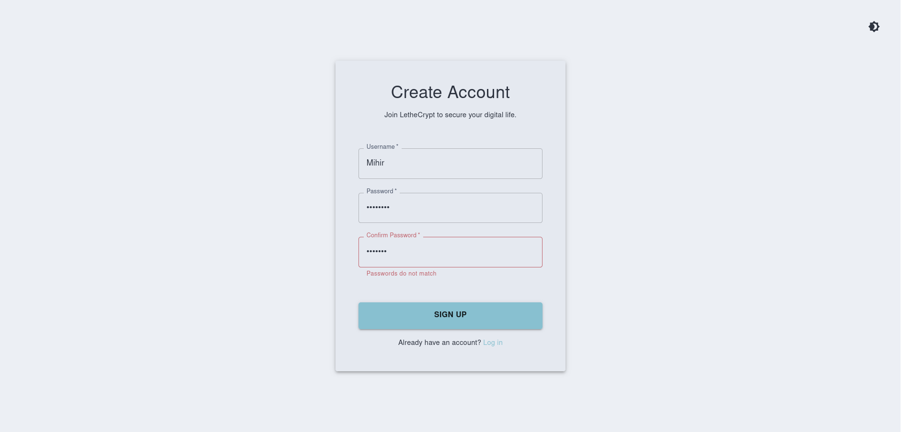
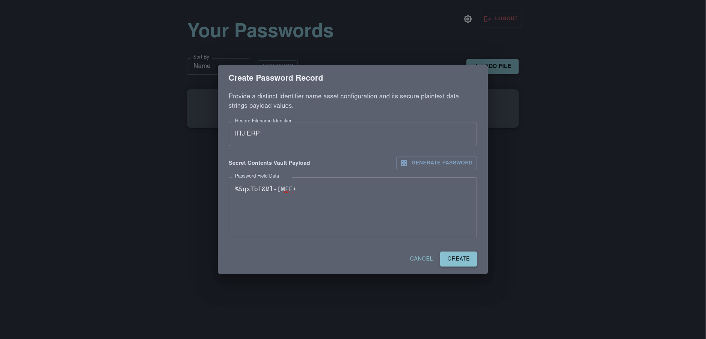
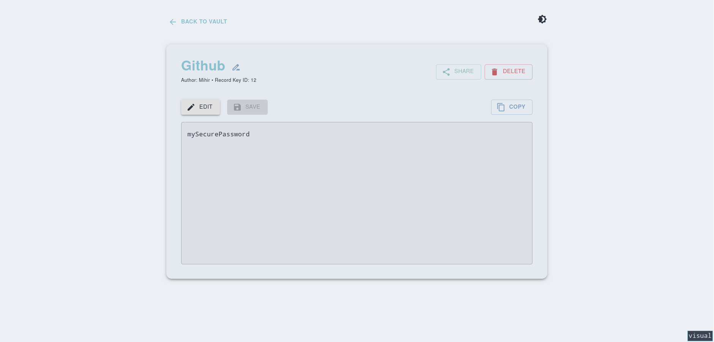
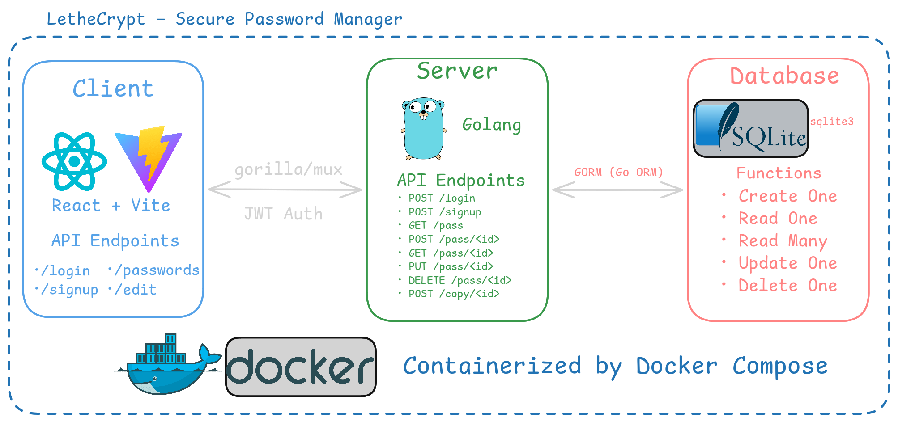

# LetheCrypt

LetheCrypt /ˈliːθiːkrɪpt/ is a simple, secure password manager with a clean Material UI frontend and a Go backend. Focused on security, minimalism, usability and Dockerisation. 

## Features
- Material Design inspired minimal UI (responsive, accessible, dark mode)
- Stateless authentication powered by JWTs (HMAC + SHA256)
- Share passwords with other users
- Completely documented by [OpenAPIv3.1 specification](openapi.yaml)
- Data at rest encryption for all passwords (using AES)

## Gallery





## Architecture


## Installation instructions
- Clone the repository
- Move `.example.env` to `.env` and modify the values as you see fit
- Generate keys via `openssl rand -hex 32` or any other cryptographically secure medium.
- Run via docker compose. Default port is 8000.


## Docker Compose
```
$ docker compose up -d
```

## Manually (for development)
```
$ git clone https://github.com/MihirGharote/LetheCrypt
$ cd client/; npm run build; cd ..  # Run this everytime client files are changed
$ go mod download
$ go run main.go
```

